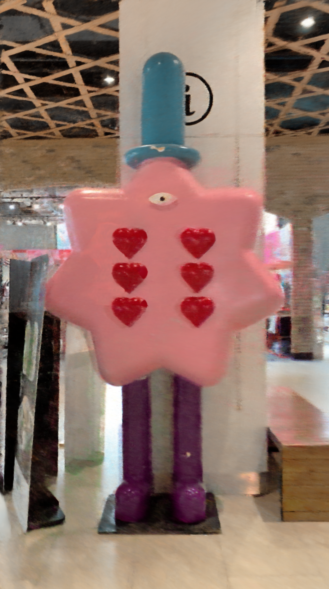
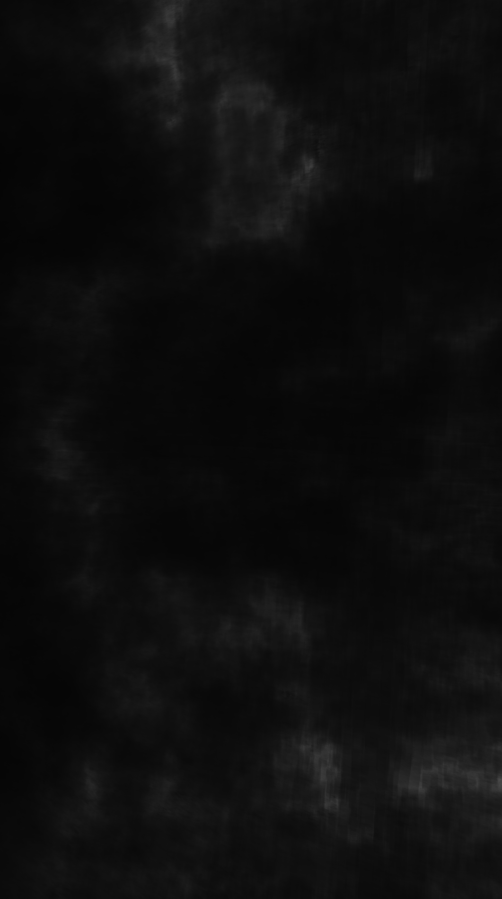
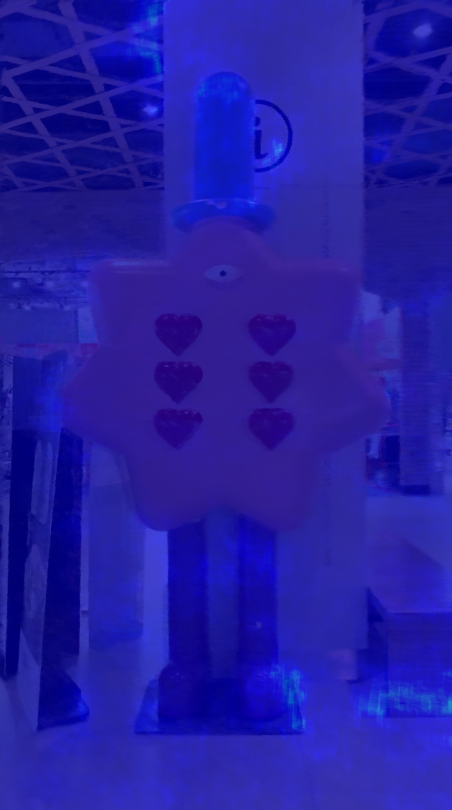

## Introduction

* This code performs alpha-blending between the rgb images and their corresponding property images e.g. heatmap.
* There are additional two approach for merging the rgb images and the property images but the results are not that interesting.
* OpenCV is used for image processing.

## Input and Output

* Input: rgb images and property images (examples are heatmap)
* Output: (generated by the code) alpha-blending images

  

## Build and Run Command

```
chmod +x build.sh
./build.sh
./build/superimpose-heatmap ./data/rgb ./data/heatmap-gray ./output
```